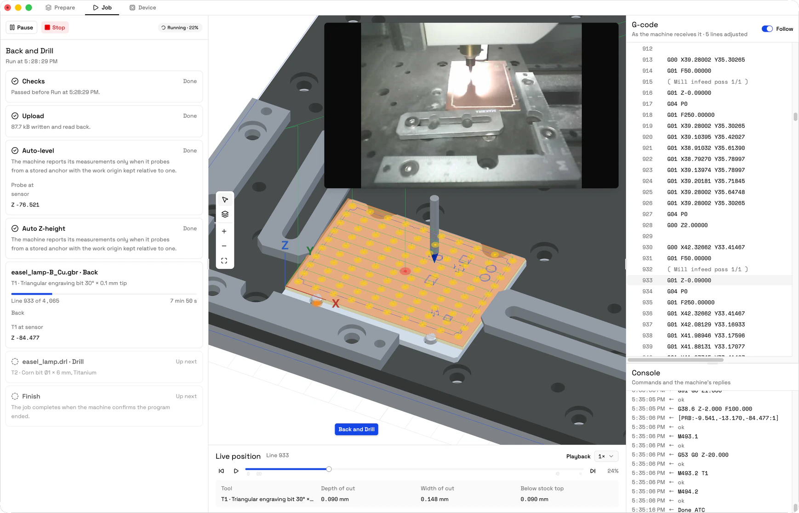
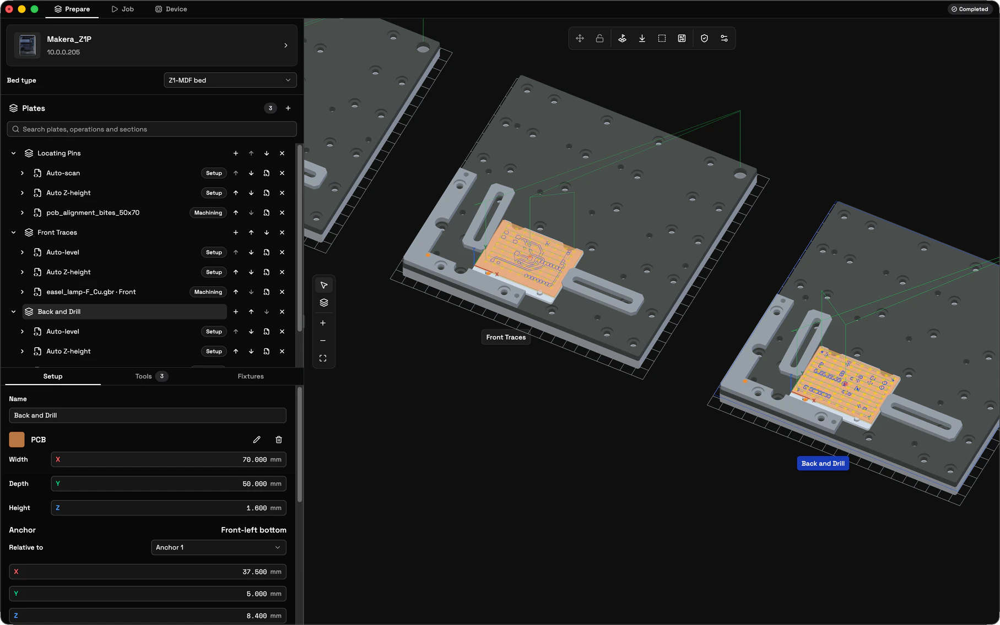

# OpenSpindle

OpenSpindle is a desktop app for preparing, checking and running jobs on a Makera Z1 CNC machine. You set up the stock, fixtures and tools on a 3D model of the machine's bed, see exactly what the machine will receive, and run the job over your local network. Nothing moves the machine until you run a job or use a control, and every command is checked against what the machine reports.



- **Plates on a 3D bed.** A plate is one setup on the bed: the stock, the fixtures (the Z1's MDF bed, L-brackets, top clamps, dowel pins and 4th axis, or your own STEP and GLB models), a work origin and a tool table, with the programs it runs. Arrange them in the 3D view, snapping to holes, corners and the machine's stored anchors.
- **Programs you can read.** Import NC files from your CAM. The Job tab plays them back and lists the G-code exactly as the machine receives it.
- **Built-in probing.** Auto-level, auto Z-height and auto-scan operations for the Makera wired probe, generated as plain, commented NC.
- **Careful runs.** Run waits for a checklist to pass, reads the uploaded program back byte for byte, and counts a job as completed only when the firmware reports it.
- **Tool library.** Import Fusion 360 tool libraries, or add the bundled Makera, Genmitsu, SpeTool, Dreanique and FoxAlien catalogs.
- **Plugins.** Sandboxed plugins add programs, importers and editors, such as the PCB plugin for KiCad Gerber and Excellon files.
- **Local.** No account and no cloud service: your projects and libraries stay on your computer.

> [!WARNING]
> OpenSpindle is early ALPHA stage software for a machine that can hurt you and itself. Some features follow the firmware's source code and a simulator and have been tested only on the Makera Z1: see [Status and safety](#status-and-safety). Review every program before you run it, and keep the machine's emergency stop within reach. If you are a developer, please feel free to fork and contribute to OpenSpindle. 

## Install

Download `OpenSpindle-<version>-universal.dmg` from the [latest release](../../releases/latest), open it and drag OpenSpindle to **Applications**. One universal app runs on Macs with Apple silicon or Intel processors, and it is signed and notarized, so macOS opens it without a warning. OpenSpindle is currently released for macOS only until we find contributors with Windows to test on.

OpenSpindle updates itself: shortly after launch and every four hours it looks for a new release, downloads it in the background and installs it when you quit. **OpenSpindle › Check for Updates…** looks right away. Run it from Applications, not from the DMG, or it cannot replace itself.

The first time OpenSpindle looks for your machine, macOS asks whether it may find and connect to devices on your local network. Allow it, or OpenSpindle cannot reach the machine.

## Quick start

1. **Connect.** With the Z1 on the same network as your computer, click the device card in **Prepare** (or **Connect device** on the **Device** tab) and choose your machine from those announcing themselves, or enter its IP address (port `2222`).
2. **Import a program.** Drop your CAM's `.nc` file (or `.cnc`, `.gcode`, `.tap`, `.ngc`) anywhere in the window. It becomes a plate.
3. **Set up the plate.** Select it: **Setup** places the stock on the bed and sets the work origin, **Tools** assigns a library tool to each T number the program uses, and **Fixtures** lists what else is on the bed.
4. **Check it.** On the **Job** tab, play the program back in the 3D view and read the G-code as the machine will receive it.
5. **Run.** **Run** is enabled once every item of the run checklist passes; a failing item says why and offers its fix. Run uploads the program, reads it back and starts it. Stop is always available, also as **Machine › Stop** (⌘.).

## Using OpenSpindle

OpenSpindle has three tabs: **Prepare** sets up plates on the bed, **Job** previews and runs them, and **Device** controls the machine.

**Edit › Undo** (**⌘Z / Ctrl+Z**) and **Edit › Redo** (**⇧⌘Z / Ctrl+Shift+Z**) step through your changes: on **Prepare** and **Job** your changes to the project (plates, operations and their settings, tool tables, design rules, a plugin's changes too) and to the tool and stock libraries; on **Device** your changes to the fixture library (definitions and alignment). Changes to one value less than a second apart, such as typing a name, are one step. With the cursor in a text field they undo its typing instead, as in any Mac app, and while a plugin's view has the focus they stay in that view. Selecting, saving, dismissing import notes and what the machine reports (anchors, measured heights) stay as they are when you undo. A removal's or a move's notification, and the tool library's Undo delete, offer Undo too, while nothing has changed since. Opening or starting a project, or reloading the window, starts a new history; undoing back to the project as you saved it leaves no unsaved changes.

### Prepare



- **Import** `.nc`, `.cnc`, `.gcode`, `.tap` or `.ngc` files by dropping them anywhere in the workspace, or with **Add operation** (**+** on a plate, **File › Import Program…**, **⇧⌘O / Ctrl+Shift+O**). Each dropped file becomes a plate; while there is more than one plate, a dialog first asks which plate to add dropped files to (the selected plate at first), or to make each a new plate; one among them that cannot be used (the wrong type, too large, or unreadable) is named in a message instead of being left out silently. Files added to a plate become its operations together, or none of them do when one is refused, such as by reaching the plate's operation limit. A new project shows the bed as an empty **Plate 1**; the first plate of your own (imported, or started by adding an operation) replaces it, keeping the fixtures set up on it and any name you gave it. A plate holds up to 100 operations, each up to 10 MiB of NC.
- **Plates** list the plates, their operations and each operation's program sections (tool changes, CAM toolpaths, probing, pauses). A plate shows its name, or **Plate N** by its place in the list until you name it under **Setup**. Search matches plates, operations and sections. Select sections (Ctrl/⌘-click, Shift-click) to highlight them in the 3D view; adjacent sections of one operation can be grouped and renamed. **+** beside the Plates title adds an empty plate with the default stock, on the selected device's bed and fixtures; a new project's empty Plate 1 stays beside it. **+** on a plate opens **Add operation** for it. Plates and operations can be reordered or removed (with Undo in the notification). Nothing is sent to a machine by importing, selecting or reordering.
- **Right-click** an operation in **Plates** to move it to another plate (**Move to**), where it keeps its library tools under that plate's own tool numbers, or to remove it; both offer Undo in the notification.
- **Plate settings** (select a plate): **Setup** (the plate's name, its stock and placement, its single work origin and the assists applied on Run), **Tools** (the plate's tool table: which library tool each T number holds, renumbering, and which operations use it) and **Fixtures** (what is on the bed, wasteboards among them). Import notes appear above them until dismissed, with anything that blocks Run and its fix.
- **Operation settings** (select an operation): its name, **Pause before this operation**, the editor for its source (an NC file's source and, when it ends with a `G28` park, **Park after machining**; a plugin program's parameters, a plugin's own view, or a probing operation's settings) and its tool bindings.
- **Auto-level** (toolbar or Add operation) adds a built-in probing operation: a G32 grid from the probe position or a stored anchor, with a review pause after probing. A new one covers the plate's cuts (its stock when it has no machining operations) from a stored anchor when the plate has them, and **Fit grid** fits it again. From an anchor, the machine rises to its clearance before it moves over the grid, as Makera Studio, Makera's own app, does; with the work origin kept relative to an anchor too, the machine's own auto-leveling (`M495`) probes the grid and reports every point, as it does for Makera Studio. See [auto-level.md](docs/auto-level.md).
- **Auto Z-height** (toolbar or Add operation) adds a built-in touch-off: the probe touches the stock top, below the probe position or at a stored anchor, and sets work Z there to match the plate's work origin. A new one touches the middle of the cuts (of the stock when the plate has no machining operations) from a stored anchor when the plate has them, and **Center** puts it there again; with the work origin kept relative to an anchor too, the machine's own Z probe (`M495`) touches and reports where. After Auto-level it is exact anywhere. See [auto-z-height.md](docs/auto-z-height.md).
- **Auto-scan** (toolbar or Add operation) traces the edges of the plate's work area with the probe's laser at a safe height, then pauses so you can check the outline against the stock before cutting. The 3D view outlines the same area. See [auto-scan.md](docs/auto-scan.md).
- **Check design rules** (the shield on the toolbar) checks the selected plate's program against the project's design rules: max cutting feed, max plunge rate, max cut depth, max depth under the stock, the spindle stopped while cutting and rapid moves into the stock. What breaks them is listed over the 3D view per operation, and **Show** highlights those lines; the check only reports and never blocks Run. **Workspace settings** (beside it) sets each rule's limit and whether it is an error, a warning or ignored; the rules are saved with the project. See [design-rules.md](docs/design-rules.md).
- **View source** shows an operation's or plate's NC and setup; **Export NC with setup** embeds the plate in versioned, integrity-checked comments without changing the NC ([plate-definition.md](docs/plate-definition.md)).

#### Setup, anchors and fixtures

The stock anchor (the stock's minimum corner) and the work origin (the program's NC zero) are bed coordinates in millimetres. New plates start with the stock centred on the support; later edits keep the coordinates. The stock-corner origin presets reposition the work origin explicitly. Setting the physical work zero happens on **Device**; saving plate coordinates never changes the controller's offsets.

When the machine stores anchors (the Z1's Anchor 1 and Anchor 2; orange dots on the bed), the stock, each fixture and the work origin can be kept relative to one: **Relative to** (under **Anchor** for the stock and fixtures, and under **Work origin**) lists the machine's anchors, then **Custom position** (bed coordinates). Relative to an anchor, it shows and edits X and Y as offsets from that anchor (Z stays on the bed), and they keep those offsets when the anchors are read again or realigned. For the work origin, Run then sets the machine's work X and Y there first, as Makera's controller does: `G10 L2 P0` at the anchor's stored machine position plus the offsets, after `G21 G54` selects millimetres and G54 (Z is left to the work zero or an auto Z-height). It needs the anchors read from the connected device. Anchors are read from the device when it connects, once it is idle; **Device → Anchors → Read anchors** reads them again, offline Z1 defaults are labelled, and **Device → Anchors → Anchor 1 on bed** (named after the first anchor) aligns them with the displayed bed without changing machine settings ([stored-anchors.md](docs/stored-anchors.md)).

**Bed type** chooses the selected plate's bed, which lies on the machine's aluminium bed (both are shown); a plate has one bed, so a bed chosen there or added with **Add fixture…** replaces it. **Fixtures** lists what is on the plate's bed, up to 32 fixtures: **Add fixture…** adds one of the device's fixtures, each row removes its item, and opening a row places it (millimetres, XYZ rotations in degrees); the Device page's fixture library stores definitions per device (model and announced name), each drawing a model bundled with OpenSpindle, a box of a set size, or one from the **Models** library (STEP or GLB files, see [models.md](docs/models.md)). New plates snapshot these definitions. The Z1 fixtures include the **MDF wasteboard**, a 100 × 100 × 2 mm box (its size is set on the Device page) that is placed, moved and locked like any fixture; the stock rests on a wasteboard under it, where new plates put it. The Z1 fixtures also include the 4 × 11 mm dowel pins, which stand 4 mm proud of the MDF bed in the bed's dowel holes to locate the L-brackets and other fixtures placed on it, and Makera's 65 × 20 × 5 mm **Top clamp**, held down by an M5 screw through its slot, whose steps under its edges (1 mm high at one end and side, 3.5 mm at the others) go over the stock's edge. Fixtures are visual; there is no collision checking.

Fixtures are placed like the stock (**Anchor**), relative to a stored anchor or at a custom position, but by their origin: the point named beside **Anchor**, which **Rotation** turns them about. Any of a fixture's mount points, such as a corner or a hole, can be made its origin there, and the fixture stays where it is; beside **Default position** on the Device page, the same choice is made for new plates. A Models library model's **Orientation** preview stands it on the face you click (**Turn** turns it 90°), so its box and front-left bottom are of the model as it stands ([models.md](docs/models.md#orientation)).

#### Arranging in the 3D view

Click anything on the bed to select it: the bed, a fixture (a wasteboard is one), the stock, or the design (its work origin axes). The inspector shows its settings, and the tools next to **Auto-level** apply to it; a tool that does not apply is greyed out and says why.

- **Move** (four arrows, **M**) moves the selected fixture, stock or design. Drag it across the bed; its points snap to the points of everything else and to the stored anchors (hold **Alt** to move freely, otherwise free moves step by 0.1 mm). Or click one of its points and then any other point: it jumps so the two meet. Moving the stock carries the design (its work origin) with it; moving the design moves only the work origin. Beds stay in place.
- **Right-click** for the axes a move keeps to (X and Y, X, Y or Z only, or all three; **X**, **Y** and **Z** toggle one axis), snapping, and, with a point picked, aligning it to the right-clicked point along chosen axes. **Esc** drops a drag or a picked point, then ends move mode, then clears the selection.
- **Lock** (**L**, also in the Fixtures panel) keeps a fixture where it is: it cannot be moved, turned or removed, in the view or in the inspector, until it is unlocked.

Mount points come from each fixture's model: the bundled Z1 bed, MDF bed and L-brackets carry their holes and corners (the brackets' inner corner is where the stock goes; a bed fixture covers the aluminium bed's holes), a dowel pin its centre where it stands in the bed, a top clamp its slot and the inner edge of each step (where the stock's edge goes), the 4th axis its chuck and tailstock centres, and other models the corners and centres of their box until **Device → Fixtures → Mount points** defines their own. The stock has its corners and centres, the design its work origin and the corners of its toolpath.

A dashed outline marks where each plate cuts: its toolpath bounds, which Fit grid, Center and Auto-scan use.

### Job

The **Job** tab previews the selected plate and runs it: the job panel on the left, the 3D view in the middle, the G-code and the console on the right.

- The **timeline** plays the program back in the 3D view, as the machine runs it, the firmware's own tool changes and probing included, with the tool in the spindle drawn from its 3D model or its dimensions from its change on and the probe's path in green (a tool with neither model nor dimensions shows as a marker); markers show tool changes, toolpaths, pauses, probing and program end, and those of the program's sections carry their operation's name, as the job's position does (Isolation · Toolpath 1). The **G-code** list shows exactly what the machine receives, marks the lines the machine dialect changes (line numbers removed, program stops sent as `M600`, the tool number added to a bare `M6`, a stop right after a tool change left out, the spindle speed added to an `M3` without one) and follows playback.
- Under the timeline, the line on show gets the tool in the spindle, its predicted **depth and width of cut** (the stock swept with each tool's shape, so a second pass or a finishing cut shows what it actually takes) and how far below the stock top the tool's tip is.
- The job panel's **toolbar** keeps the job's controls in view: **Run**, then **Pause**, **Resume**, **Tool installed** and **Stop** as the job allows, and **Dismiss** once it has ended. Under it the panel shows the run as **stages**, one card each: the **run checklist**, the upload, every operation and the end. **Run** is enabled once every item of the checklist passes: device connected, plate compiles, tools assigned, operations up to date, plate matches the machine, program transfers, machine ready. Each failing item says why and offers its fix; the ones that pass fold away.
- While a job runs, the view follows the machine's line (scrub to look around, **Back to live** to return), and the job's phase shows in the header on other tabs. The card of the stage the job is in shows its progress or prompt: a tool change names the requested tool and continues with **Tool installed** (not offered on ATC machines); pauses show which operation or program stop paused the job; the auto-level review reads and analyses the height map before you Resume or Stop. Operation cards keep what the machine measured: where an auto Z-height touched the stock top, an auto-level's grid as it is probed, the tools measured at the tool sensor.
- Run uploads to a unique `/sd/gcodes/openspindle-<UUID>.nc`, reads every byte back, re-checks the machine, then plays it once. A program larger than the machine takes at once (4 MiB or 250,000 lines, up to 10 MiB) runs as one job in parts split at its tool changes: every part is uploaded and read back first, and each plays as soon as the one before has finished. A job counts as completed only after the firmware's own completion report. Stop is always available. See [device-jobs.md](docs/device-jobs.md).

### Device

Click the device card in Prepare or **Connect device** on Device. The picker listens for Makera devices announcing on the local network (discovery never opens a connection) and offers an IP address and port (default `2222`). A device connected by address takes the name it announces, so its fixture profile and height maps stay the same however it was connected. When OpenSpindle opens, it tries once to reconnect to the device it was last connected to; nothing else from the last session is restored.

The Device page shows the camera, machine and work coordinates, jogging, homing, work zero, spindle, light, beep, vacuum, overrides and job pause/resume/Stop. **Unlock** clears an alarm (`$X`); **Reset** restarts the machine's controller after a confirmation, and OpenSpindle connects to it again when it is back. Every control is admitted by the machine's current state (a disabled control says why), verified by acknowledgement and telemetry, and never retried automatically. Stop (also **Machine › Stop**, ⌘.) preempts everything. Application limits: jog 10 mm at 25% speed, spindle 1,000–10,000 RPM, overrides 50–150%. See [device-controls.md](docs/device-controls.md).

The camera streams from `ws://<host>:82/ws_video` (the Z1's Wi-Fi module). **Measured heights** retrieves the machine's current height map with `M375.1` (display only) ([device-height-map.md](docs/device-height-map.md)).

### Tool library

Open a plate's **Tools** tab and choose a tool, or **Manage tool library**. The table (search, type and shank filters, sortable columns) and the editor cover general details (including the vendor's own description, a product photo chosen from an image file, and a 3D model), cutter geometry, the shaft (segments from the shoulder up, such as the taper to the shank; Fusion 360's Shaft tab), cutting presets (speeds, feeds, ramp angle, stepover and stepdown), holders and post-processor settings. Tools are drawn from their 3D model or else their dimensions, without their holders: the table shows each tool's cutting end, the editor the whole tool, following every edit. A 3D model is a binary glTF (`.glb`) file of up to 1 MB, kept in the tool, with the tool's tip at its origin and its axis pointing up (+Y, in metres, as glTF has it). A probe without one is drawn as a ball on its stylus. The Makera Wired Probe 2.0 comes with a model of it; its dimensions are estimated from Makera's product photos. Tools can be created, edited, duplicated and deleted (Undo while the dialog is open). Deleting a library tool changes no plate: an entry that pointed at it blocks Run until another tool is assigned.

**Import** accepts the `.zip` libraries OpenSpindle exports (and the `.json` of its earlier versions) and Fusion 360 JSON, `.tools` and ZIP libraries (inch values convert to millimetres; source records are kept as metadata and never executed), skipping tools already in the library unchanged. A library file may be up to 256 MB, and the library holds up to 10,000 tools. **Export** saves the library as a `.zip`: the tools as JSON, with their photos and 3D models as files beside it. **Add catalog** offers the supplied Makera (124 tools and the probe), Genmitsu (211), SpeTool (220), Dreanique (23 thread mills) and FoxAlien (1) collections. Catalog tools are named by style and size in their own unit (`O-flute Ø3.175 × 17 mm`, `V-bit 90° Ø1/2″`), with vendor, product ID and coating in their own fields; tools listed twice (five-packs, kits) are merged, and dimensions the vendors' own pages contradict are corrected. A new library starts with eight Makera cutters, the Makera Wired Probe 2.0 (always T0) and the FoxAlien CRB-VS-3E30DB engraving bit with a PCB preset.

### Projects and your data

- OpenSpindle starts with a new project every time it opens: an empty Plate 1 on the selected device's bed and fixtures. Reloading the window (**View › Reload**, ⌘R / Ctrl+R) keeps the project you have open. **⌘N / Ctrl+N** starts a new project, **⌘S / Ctrl+S** saves the project (its plates, measured heights and design rules, with a copy of the tool and stock libraries) as a STEP-NC project, and **⌘O / Ctrl+O** (or dropping a `.stpnc`) opens one. Starting or opening a project asks first when there are unsaved changes, and so does closing the window. Opening keeps your libraries and adds the tools the project's plates use that yours lacks. Projects refer to the plugins they use rather than including them ([step-nc-projects.md](docs/step-nc-projects.md)).
- The tool and stock libraries, the fixture library, the Models library and installed plugins are kept between launches, in the app's data folder (`~/Library/Application Support/OpenSpindle`). Stored data that cannot be restored, including data of an earlier version, is reported before anything is written: save a copy, continue without the damaged items, or clear and start fresh. The original is always backed up first (the last ten backups of each are kept in the data folder's `backups`).

### When something goes wrong

If part of the window fails, it shows **Something went wrong** with **Try again**, and the error dialog opens. It shows the error's ID (quote it when you ask for help), takes a description of what you were doing, and sends a report to the developers with the log and, if you tick it, the open project. **Download log** saves the log, and **Open GitHub issue** starts an issue with the error, its ID and your versions filled in. An error that breaks nothing shows in a notification whose **Report…** opens the same dialog.

The log is kept in `~/Library/Logs/OpenSpindle`, the current file and the one before it; **Help › Export Log…** saves a copy. In **Settings**, **Debug level** sets how much it records (Error, Warning, Info or Debug; Info at first), and **Send error reports automatically** sends each error as it happens, with the app version, system details (macOS version, processor, memory, screen, language and time zone) and what led up to it (the app's last actions and the log's last lines, which name the connected machine and its address), never a project. It is on at first; turned off, nothing is sent until you choose **Send report**.

### Plugins

Plugins add reusable NC programs, importers and operation editors. **Plugins** in the app menu (or **Manage plugins** in Add operation) installs public GitHub repositories containing `openspindle-plugin.json`, and during development local folders; downloads are pinned to a commit, every file is checked, and a review lists what the plugin may do before anything is installed. Installed plugins can be enabled, disabled, updated and removed. Their template programs and importer views appear in **Add operation** and, as shortcuts, over the 3D viewer; operations a plugin created open its editor view in the inspector. Plugin views run in sandboxed frames and reach the workspace only through the app's API; no plugin can move the machine or run programs. See [plugins.md](docs/plugins.md) for the platform, manifests, templates and the SDK.

The PCB plugin, `openspindle-pcb`, is a separate project: importer and editor views that turn KiCad Gerber and Excellon exports into operations, with a companion that runs its bundled pcb2gcode on Apple silicon Macs. Plugins with a companion install from a local folder only.

## Status and safety

OpenSpindle's machine behaviour follows the source of [Makera's Z1 firmware](https://github.com/MakeraInc/MakeraZ1Firmware/tree/b3a2e26a9eaa2b01358f74ccdef549b993a08175) and is exercised against a simulator; on a Z1 Pro, uploads and their full readback have been verified. These still need a real Z1 before you rely on them:

- Run starts the program: OpenSpindle plays it as Makera Studio does, from `/sd/gcodes` and without `-v`;
- a normal job reports `completed` only after it truly ends, including a program that ends with an M5 dwell and one with bed cleaning;
- the done snapshot's line count equals the prepared line count (Job details show both), and the ESP32 forwards that final status;
- `M600` pauses and **Resume** continues, also with the machine's after-suspend settings, including the auto-level review pause;
- a bare `M6` after a `T` word, as pcb2gcode writes it, changes to that tool: OpenSpindle adds the tool number the firmware needs on the `M6` line and leaves out the stop right after it;
- a bare `M3` after an S word on a line of its own or on a `G0`, as pcb2gcode writes them, starts the spindle at that speed: OpenSpindle adds the speed to the `M3` line, the only place the firmware reads it;
- a manual tool change shows the requested tool and **Tool installed** continues; a job's first change, the probe's included, stops and measures even when the machine believes that tool is loaded; an ATC machine never offers it;
- Stop during upload and during a job ends in Alarm; Home clears it;
- a program sent in parts plays each part right after the one before completes, picks up its modal state at the cut, and cleans the bed only after the last part;
- the macOS Local Network permission prompt appears on first connection, and a job keeps being tracked with the window hidden;
- the auto-level probing program itself: firmware and probe compatibility are source-checked, and the firmware's own `M495` auto-leveling is what Makera Studio runs, but OpenSpindle's program has not run on a machine. Its setup requirements (homed machine, calibrated compatible probe, verified probe input, correct starting XY/Z, a reachable clear grid) are in [auto-level.md](docs/auto-level.md#firmware-background);
- the auto Z-height touch-off: it follows the firmware's own Z probe, or runs it (`M495`) from a stored anchor, source-checked, but has not run on a machine; check the work Z it sets before cutting ([auto-z-height.md](docs/auto-z-height.md#firmware-background));
- the auto-scan trace: it follows the firmware's own margin scan, source-checked, but has not run on a machine ([auto-scan.md](docs/auto-scan.md#firmware-background)).

Whatever the status of a feature: importing, previewing and saving never send anything to the machine, and Run lives only on the Job tab. Controls are refused when the machine's state does not allow them, and a command whose outcome is unknown is never retried. No plugin can move the machine or run a program. Stop does not replace the machine's physical emergency stop.

When something behaves differently, the console under the G-code on the Job tab shows what the app sent and what the machine replied, and **Help › Export Protocol Trace…** saves the recent exchange with the machine (never program contents). If you have a Z1 and can check one of the items above, please open an issue with what you saw and the trace.

## Documentation

For users:

- [Auto-level](docs/auto-level.md), [auto Z-height](docs/auto-z-height.md) and [auto-scan](docs/auto-scan.md): the probing operations, their settings and the NC they generate
- [Stored anchors](docs/stored-anchors.md): the machine's anchors on the bed, and setups kept relative to them
- [Models](docs/models.md): the Models library, fixtures and mount points
- [Design rules](docs/design-rules.md): the checks, their limits and what they measure
- [Device controls](docs/device-controls.md), [running programs](docs/device-jobs.md) and [the height map](docs/device-height-map.md): what each control and Run send, and how they are verified
- [Project files](docs/step-nc-projects.md) and [exported NC](docs/plate-definition.md): the file formats

For developers:

- [Architecture](docs/architecture.md) and [the workspace model](docs/workspace-model.md)
- [Plugins](docs/plugins.md): the plugin platform, manifests, templates and the SDK
- [Releasing](docs/releasing.md): signing, notarizing, publishing and updates

## Contributing

Contributions are welcome, from people and from their coding agents. OpenSpindle is young and there is plenty to do:

- **Test on a real machine.** If you have a Z1, checking an item from [Status and safety](#status-and-safety) and reporting what happened helps the most right now. The open release pull request has a build of the next release to try ([how](docs/releasing.md#trying-the-next-release)).
- **Support more machines.** Everything above the firmware adapter is meant to be machine-agnostic: another controller is another firmware adapter (`src/machine/firmware/<vendor>`), and a machine's bed, fixtures and factory anchors are a fixture kit (`src/domain/fixtures/`).
- **Add tools.** Every bundled tool is data: `public/tool-libraries/catalogs.json` lists the catalogs with their files (Fusion 360 JSON or the native library format, edited in place) and the starter tools a new library begins with, and `provenance.json` records where each catalog came from and what was corrected.
- **Write a plugin.** [docs/plugins.md](docs/plugins.md) describes the platform and the SDK.
- **Fix and polish.** Bugs, rough edges, and these docs.

### Development

You need Node.js 22.18 or later (the build scripts run TypeScript directly) and, to build releases, macOS.

```sh
npm ci
npm run dev
```

`npm run dev` starts the app with the renderer's dev server. Its data lives in `~/Library/Application Support/OpenSpindle-dev`, apart from an installed OpenSpindle's. Without a machine, start the simulator and connect to `127.0.0.1` (`npm run sim:z1 -- --help` lists its options, including fault injection):

```sh
npm run sim:z1
```

Before you open a pull request, these must pass (`npm run format` fixes what `check` finds):

```sh
npm run typecheck
npm run lint
npm run check
npm run build
```

Automated tests (`npm test`) cover only the Makera dialect's spindle speed so far, so say in the pull request how you checked your change. A change to what is sent to the machine should say how it was verified: against the simulator, with a protocol trace, or on a real machine.

[AGENTS.md](AGENTS.md) holds the project's conventions: the code layout, the UI rules, and what never goes into generic code. [docs/architecture.md](docs/architecture.md) and [docs/workspace-model.md](docs/workspace-model.md) explain how the pieces fit.

### Pull requests

`main` is the only long-lived branch. Branch from it, keep a branch to one change and open the pull request early, so that it merges within a day or two instead of drifting from `main`. CI runs the checks above, and a pull request is squash-merged once they pass. Its title becomes the commit on `main` and a line of the release notes, so it is a [Conventional Commit](https://www.conventionalcommits.org/) that says what changed for people using the app, in the present tense:

```text
feat: Probing from a stored anchor runs the Z1's own routines
fix(tool-library): The Flutes column shows in full beside the scrollbar
```

- `feat`, `fix`, `perf` (faster) and `revert` go into the release notes that installed apps show before updating, and decide the next version ([docs/releasing.md](docs/releasing.md#versions)).
- `docs`, `style`, `refactor`, `test`, `build`, `ci` and `chore` stay out of them.
- A `!` before the colon marks a breaking change, such as a plugin API change that existing plugins must be updated for: `feat!: …`.
- The scope in parentheses is optional.

Only the title counts; the commits on the branch can say anything. Leave the version, CHANGELOG.md and `.release-please-manifest.json` alone: the release pull request updates them.

### Coding agents

Agents are welcome here. Point yours at [AGENTS.md](AGENTS.md), which is written for you as much as for people. Keep each change to one purpose, run the checks above, update the README or the doc in `docs/` that describes what you changed, and say in the pull request what changed and how you checked it.

### Maintainers

- `npm run build` bundles the main process, preload, renderer and plugin frame into `out/`, and `npm run start` runs that build. `npm run package:mac` makes an ad-hoc signed `release/mac*/OpenSpindle.app` for this Mac; `npm run dist:mac` builds a signed and notarized release with the certificate and notarytool profile named in `.env` (copy `.env.example`). Merging the release pull request that release-please keeps open publishes a release, which installed apps update to: see [docs/releasing.md](docs/releasing.md), which also covers the repository's one-time setup on GitHub.
- The bed, MDF bed, L-bracket and 4th-axis models in `public/models/` are kept as they are; `scripts/dowel-pin.mjs`, `scripts/top-clamp.mjs` and `scripts/wired-probe.mjs` make the dowel pin, the top clamp and the wired probe ([how](public/models/README.md)).
- `build/icon.svg` is the app icon's source, drawn on the macOS icon grid; `npm run icon` renders `build/icon.icns` and `build/icon.png` from it on macOS.

## Acknowledgements

Framing, model identification and the probing sequences follow [Makera's Z1 firmware](https://github.com/MakeraInc/MakeraZ1Firmware/tree/b3a2e26a9eaa2b01358f74ccdef549b993a08175); passive UDP discovery on port `3333`, the camera stream and the file transfer follow the [Carvera Community Controller](https://github.com/Carvera-Community/Carvera_Controller/tree/63da3c0a8ab6bca2563ff4c2aadb7ab5323335bf/carveracontroller) (`WIFIStream.py`, `addons/camera/Z1Camera.py`, `XMODEM.py` and `protocols/framing.py`). The About panel credits the open-source software OpenSpindle includes.

